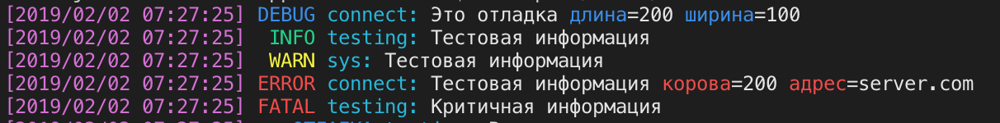
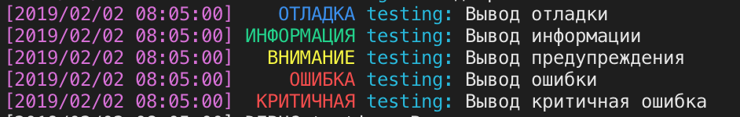

# 

[](https://github.com/khorevaa/logos-color-console/stargazers)
[](https://github.com/khorevaa/logos-color-console/releases)
[](https://gitter.im/EvilBeaver/oscript-library)

[](https://travis-ci.org/khorevaa/logos-color-console)
[](https://coveralls.io/github/khorevaa/logos-color-console?branch=master)

# Библиотека `logos-color-console`

> Библиотека реализует класс `ЦветнойВыводЛогаКонсоль` для цветного вывода в консоль

* Вывод лога в стандартной раскладке
    
* Вывод лога с русской раскладке
    
## Особенности

> Данный класс вывода сообщения игнорирует форматирование сообщений сторонними `раскладками` библиотеки `logos`

## Возможности

* Красивый и цветной вывода логов в консоль
* Вывод префиксов сообщений (дополнительной информации после уровня сообщения)
* Вывод даты события
* Вывод цветных ключей дополнительных полей
* Цветовая раскраска по уровням сообщения
* `Две` встроенных карты названий сообщений (RU и ENG) 
* Возможность задать свою карту названий уровней сообщений
* Возможность задать свой формат даты события сообщений
* Возможность задать свою цветовую гамму уровней сообщений, даты события и префикса
* Возможность отключать вывод даты, префиксов и цвета

## Установка

Для установки необходимо:
* Скачать файл logos-color-console*.ospx из раздела [releases](https://github.com/khorevaa/logos-color-console/releases)
* Воспользоваться командой:

```
opm install -f <ПутьКФайлу>
```
или установить с хаба пакетов

```
opm install logos-color-console
```

## Пример работы

* Добавление как способа вывода логов
```bsl

    Лог = Логирование.ПолучитьЛог("oscript.lib.logos");
    ЦветнойВывод = Новый ЦветнойВыводЛогаКонсоль;
    Лог.ДобавитьСпособВывода(ЦветнойВывод);

    Лог.Информация("Сообщение лога");
	
```

* Вывод информации с префиксом
```bsl

    Лог = Логирование.ПолучитьЛог("oscript.lib.logos");
    ЦветнойВывод = Новый ЦветнойВыводЛогаКонсоль;
    Лог.ДобавитьСпособВывода(ЦветнойВывод);

    Лог.Поля("prefix", "connect").Информация("Сообщение лога");
	
```

> Больше примеров смотри [тут](/tests/ЦветнаяКонсоль_test.os)

## Публичный интерфейс

[Документация публичного интерфейса (в разработке)](docs/README.md)

## Доработка

Доработка проводится по git-flow. Жду ваших PR.

## Лицензия

Смотри файл [`LICENSE`](LICENSE).
